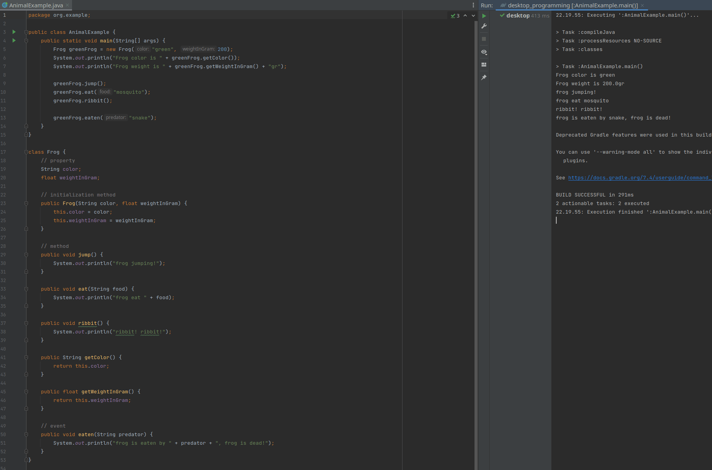
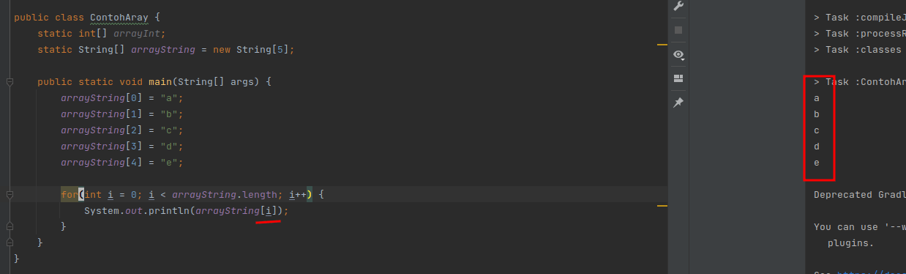

Pemrograman Desktop - Tugas 1
=======================

**Nama :** **Tito Pandu Brahmanto**

**NIM :** **042065142**

## Soal No 1

Gambarkan/Ilustrasikan yang disertai penjelasan oleh Anda sebuah binatang, supaya dapat diterapkan ke dalam bahasa 
pemograman java berupa object, Method, Event, dan property.

### Jawab
Jika seekor binatang, misalnya katak kita terapkan dalam bahasa pemrograman Java, maka ilustrasinya adalah sebagai 
berikut

1. Bentuk atau sifat dan tingkah laku binatang katak ini sebagai **Class** atau blueprint.
2. Seekor katak adalah sebuah **Object** yang terbentuk oleh Class atau blueprint binatang jenis katak.
3. Setiap katak dapat melompat, makan dan mengeluarkan suara. Ketiga contoh tingkah laku ini merupakan **Method** dari
   katak.
4. Warna, berat, ukuran katak merupakan **property-property** atau bisa disebut juga sifat-sifat pada binatang ini.
5. Seekor katak memiliki pemangsa atau predator alami. Ular merupakan salah satu predator alami katak. Saat katak
   dimangsa oleh ular maka itu adalah sebuah **Event** atau kerjadian terhadap object.

Berikut ini contoh programnya.

```java
public class AnimalExample {
    public static void main(String[] args) {
        Frog greenFrog = new Frog("green", 200);
        System.out.println("Frog color is " + greenFrog.getColor());
        System.out.println("Frog weight is " + greenFrog.getWeightInGram() + "gr");

        greenFrog.jump();
        greenFrog.eat("mosquito");
        greenFrog.ribbit();

        greenFrog.eaten("snake");
    }
}

class Frog {
    // property
    String color;
    float weightInGram;

    // initialization method
    public Frog(String color, float weightInGram) {
        this.color = color;
        this.weightInGram = weightInGram;
    }

    // method
    public void jump() {
        System.out.println("frog jumping!");
    }

    public void eat(String food) {
        System.out.println("frog eat " + food);
    }

    public void ribbit() {
        System.out.println("ribbit! ribbit!");
    }

    public String getColor() {
        return this.color;
    }

    public float getWeightInGram() {
        return this.weightInGram;
    }

    // event
    public void eaten(String predator) {
        System.out.println("frog is eaten by " + predator + ", frog is dead!");
    }
}
```



\newpage

## Soal No 2

Perhatikan contoh program java berikut ini:

```java
import java.util.Scanner;

public class Menghitung_luas_segitiga {
    public static void main(String[] args) {
        Scanner input = new Scanner(System.in);
        int a, t;
        double luas;
        
        System.out.print("Masukan Alas: ");
        a = input.nextInt();
        System.out.print("Masukan Tinggi: ");
        t = input.nextInt();
        
        luas = 0.5 * a * t;
        System.out.println("Luas Segitiga: " + luas);
    }
}
```

Dari program java di atas, identifikasi tipe data, variabel, identifier, dan operator!

### Jawab

1. Tipe data yang digunakan dalam program di atas adalah:
   * `Scanner` - tipe data class Scanner
   * `int` - tipe data primitif int
   * `double` - tipe data primitif double

2. Variable yang digunakan dalam program di atas adalah:
   * `args` - variabel argument dari main
   * `input`
   * `a`
   * `t`
   * `luas`

3. Identifier yang digunakan dalam program di atas adalah:
   * nama class `Menghitung_luas_segitiga`
   * `args`, `input`, `a`, `t`, `luas`

4. Operator yang digunakan dalam program di atas adalah:
   * `=` - yaitu operator assignment untuk variable `input`, `a`, `t`, `luas`.
   * `+` - yaitu operator tambah yang digunakan untuk menggabungkan string "Luas Segitiga: " 
     dengan variabel `luas`.


## Soal No 3

Perhatikan contoh program array java berikut ini

```java
public class ContohAray {
    static int[] arrayInt;
    static String[] arrayString = new String[5];
    
    public static void main(String[] args) {
       arrayString[0] = "a";
       arrayString[1] = "b";
       arrayString[2] = "c";
       arrayString[3] = "d";
       arrayString[4] = "e";

       for (int i = 0; i < arrayString.length; i++) {
          System.out.println(arrayString[1]);
       }
    }
}
```

Hasil dari program tersebut adalah:

Output:

```text
b
b
b
b
b
```

Modifikasi program java di atas sehingga menghasilkan output seperti di bawah ini:

Output:

```text
a
b
c
d
e
```

### Jawab

```java
public class ContohAray {
   static int[] arrayInt;
   static String[] arrayString = new String[5];

   public static void main(String[] args) {
      arrayString[0] = "a";
      arrayString[1] = "b";
      arrayString[2] = "c";
      arrayString[3] = "d";
      arrayString[4] = "e";

      for(int i = 0; i < arrayString.length; i++) {
         System.out.println(arrayString[i]);
      }
   }
}
```


