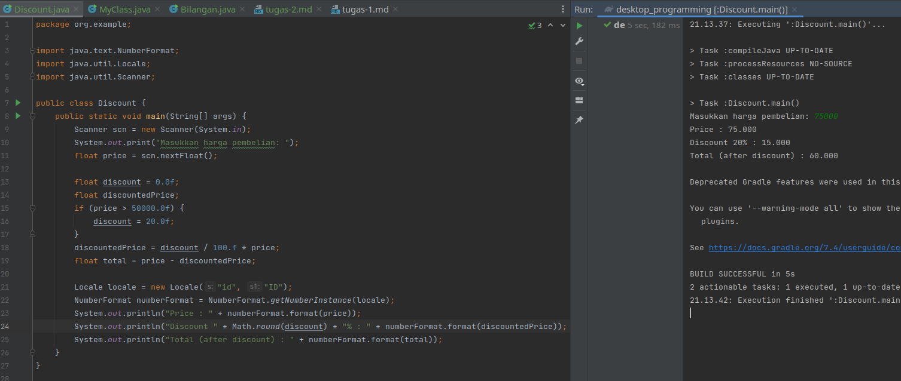
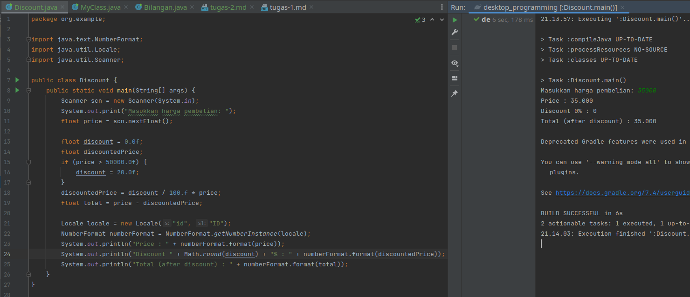
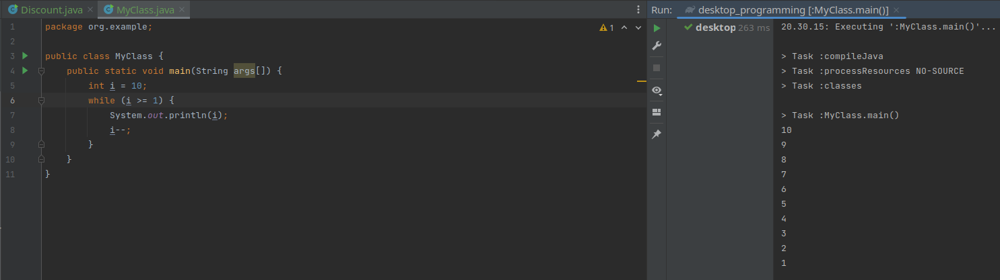
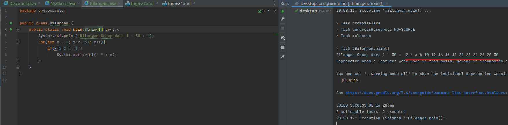

Pemrograman Desktop - Tugas 2
=======================

**Nama :** **Tito Pandu Brahmanto**

**NIM :** **042065142**

## Soal No 1

Buatlah screen shoot sebuah program diskon menggunakan bahasa pemrograman java disertai outputnya dengan ketentuan:

1. jika pembelian lebih dari 50.000 maka diskon 20%.
2. Tampilkan harga total yang harus dibayar oleh pembeli.

Misal (pembelian : 100.000 maka total yang harus dibayarkan 80.000)

### Jawab 

```java
package org.example;

import java.text.NumberFormat;
import java.util.Locale;
import java.util.Scanner;

public class Discount {
    public static void main(String[] args) {
        Scanner scn = new Scanner(System.in);
        System.out.print("Masukkan harga pembelian: ");
        float price = scn.nextFloat();

        float discount = 0.0f;
        float discountedPrice;
        if (price > 50000.0f) {
            discount = 20.0f;
        }
        discountedPrice = discount / 100.f * price;
        float total = price - discountedPrice;

        Locale locale = new Locale("id", "ID");
        NumberFormat numberFormat = NumberFormat.getNumberInstance(locale);
        System.out.println("Price : " + numberFormat.format(price));
        System.out.println("Discount " + Math.round(discount) + "% : " + numberFormat.format(discountedPrice));
        System.out.println("Total (after discount) : " + numberFormat.format(total));
    }
}
```





\newpage

## Soal No 2

```java
public class MyClass {
    public static void main(String args[]) {
        int i = 1;
        while (i <= 10) {
            System.out.println(i);
            i++;
        }
    }
}
```

Modifikasi oleh Anda program di atas tanpa merubah struktur program sehingga menghasilkan output deret 1 s.d 10 terurut 
menurun. Kumpulkan bukti kode program dan outputnya berupa screenshot.

### Jawab

```java
package org.example;

public class MyClass {
    public static void main(String args[]) {
        int i = 10;
        while (i >= 1) {
            System.out.println(i);
            i--;
        }
    }
}
```



\newpage

## Soal No 3

```java
public class Bilangan {
    public static void main(String[] args) {
        System.out.print("Bilangan Ganjil dari 1 - 30 : ");
        for (int x = 1; x <= 30; x++) {
            if (x % 2 == 1)
                System.out.print(" " + x);
        }
    }
}
```

Kode program di atas adalah menampilkan bilangan ganjil. Modifikasi oleh Anda dari kode
program di atas sehingga menampilkan bilangan genap!

### Jawab

```java
package org.example;

public class Bilangan {
    public static void main(String[] args){
        System.out.print("Bilangan Genap dari 1 - 30 : ");
        for(int x = 1; x <= 30; x++){
            if(x % 2 == 0 )
                System.out.print(" " + x);
        }
    }
}
```


