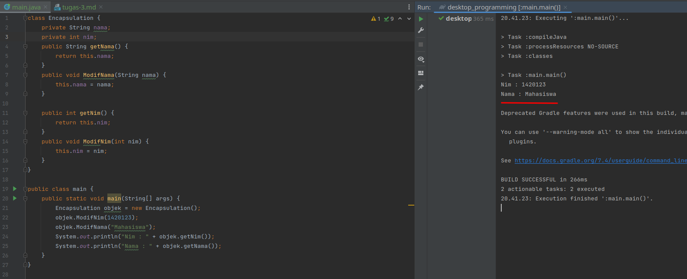

Pemrograman Desktop - Tugas 2
=======================

**Nama :** **Tito Pandu Brahmanto**

**NIM :** **042065142**

## Soal No 1

```java
class Encapsulation {
 private String nama;
 private … nim;
 public String getNama() {
 return this.nama;
 }
 public void ModifNama(String nama) {
 this.nama = nama;
 }

 public int …() {
 return this.nim;
 }
 public void ModifNim(… nim) {
 this.nim = …;
 }
}
public class main {
 public static void main(String[] args) {

 Encapsulation objek = new Encapsulation();
 …………………………..(1420123);
 objek.ModifNama("Mahasiswa");
 System.out.println("Nim : " + objek…..());
 System.out.println("… : " + objek.getNama());
 }
}
```

Lengkapi kode program di atas sehingga menghasilkan output:
```text
Nim : 1420123
Nama : Mahasiswa
```

### Jawab

```java
class Encapsulation {
    private String nama;
    private int nim;
    public String getNama() {
        return this.nama;
    }
    public void ModifNama(String nama) {
        this.nama = nama;
    }

    public int getNim() {
        return this.nim;
    }
    public void ModifNim(int nim) {
        this.nim = nim;
    }
}

public class main {
    public static void main(String[] args) {
        Encapsulation objek = new Encapsulation();
        objek.ModifNim(1420123);
        objek.ModifNama("Mahasiswa");
        System.out.println("Nim : " + objek.getNim());
        System.out.println("Nama : " + objek.getNama());
    }
}
```



\newpage

## Soal No 2

Perhatikan contoh kode program di bawah ini:

```java
public class overloading{
    public void segitiga(){
        int alas=5, tinggi=10;
        System.out.println("Luas segitiga satu = "+(alas*tinggi)/2);
    }

    public void segitiga2(int x, int y){
        System.out.println("Luas segitiga dua = "+(x*y)/2);
    }
    
    public static void main(String [] args){
        System.out.println("Contoh Overloading");
        System.out.println("");
        overloading s3;
        s3 = new overloading();
        s3.segitiga();
        s3.segitiga2(20,8);
    }
} 
```

Kode program di atas adalah Polymorphism. Jawablah pertanyaan berikut ini:
a. Sebutkan dan jelaskan jenis dari Polymorphism dari program di atas
b. Jelaskan baris kode pada no 1,2, dan 3.

### Jawab
a. Jenis dari polymorphism ini adalah Static Polymorphism atau trivial atau disebut juga function
   overloading (penggunaan kembali nama fungsi yang sama tapi dengan argumen yang berbeda). Seharusnya
   pada baris kode no 1 menggunakan nama fungsi yang sama, yaitu segitiga. Sehingga nama fungsi yang sama
   dapat digunakan dengan argumen yang berbeda.

b. Berikut ini penjelasan beberapa baris kode
   1. Baris kode ini adalah pembuatan method overload. Seharusnya menggunakan nama `segitiga` sehingga
      dapat meng-overload method segitiga sebelumnya yang tanpa argumen. Baris kode ini menghitung
      perkalian argumen x dan y, lalu dibagi 2. Sesuai dengan rumus luas segitiga yaitu `alas * tinggi / 2`
   2. Baris kode ini adalah pemanggilan method `segitiga` yang tidak memiliki argumen. Alas dan tinggi
      sudah di-assign di dalam method ini dengan `alas = 5` dan `tinggi = 10`
   3. Baris kode ini adalah pemanggilan method `segitiga2` (seharusnya `segitiga`) yang memiliki argumen
      x dan y.

```java
public class overloading{
    public void segitiga(){
        int alas=5, tinggi=10;
        System.out.println("Luas segitiga satu = "+(alas*tinggi)/2);
    }

    public void segitiga(int x, int y){
        System.out.println("Luas segitiga dua = "+(x*y)/2);
    }

    public static void main(String [] args){
        System.out.println("Contoh Overloading");
        System.out.println("");
        overloading s3;
        s3 = new overloading();
        s3.segitiga();
        s3.segitiga(20,8);
    }
}
```


### Sumber: BMP Pemrograman Berbasis Desktop MSIM4301 - Modul 8